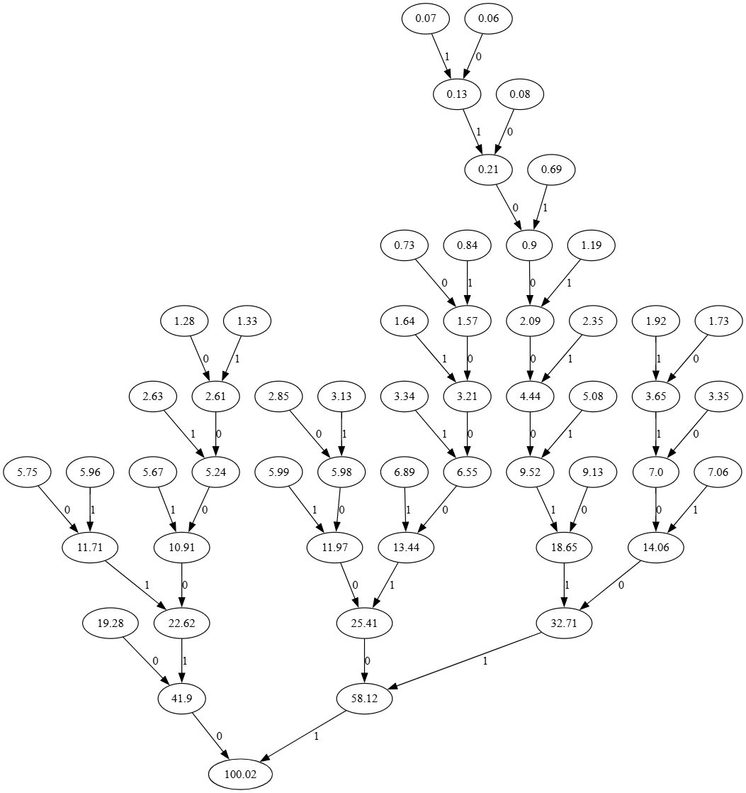

# Huffman coding

This is a toy project of building a Huffman coder. 

## How?

<details>
<summary>Deeper explanation</summary>
We use the following propability distribution of letters:
    
```python
LETTERS = {
    " ":19.28,
    "a":5.75,
    "b":1.28,
    "c":2.63,
    "d":2.85,
    "e":9.13,
    "f":1.73,
    "g":1.33,
    "h":3.13,
    "i":5.99,
    "j":0.06,
    "k":0.84,
    "l":3.35,
    "m":2.35,
    "n":5.96,
    "o":6.89,
    "p":1.92,
    "q":0.08,
    "r":5.08,
    "s":5.67,
    "t":7.06,
    "u":3.34,
    "v":0.69,
    "w":1.19,
    "x":0.73,
    "y":1.64,
    "z":0.07
}
```

Any other character will be disregarded. This has entropy of `4.10944619015985` bits.

Using it results in this Huffman tree:

which is used for creating the encodings for the characters.
</details>

1. Run `./main.py`
2. Follow the usage guide:
```
usage:
     dec <string to decode>
     enc <string to encode>

Example:
    >enc kissa istuu puussa
     10100011001010101010110001001010111011010110101001100111010110101010101010110

    >dec 10100011001010101010110001001010111011010110101001100111010110101010101010110
     kissa istuu puussa

Please use only items from these charsets:

encoding:  abcdefghijklmnopqrstuvwxyz 
decoding: 01
```

## Why?

This is inspired and based on the lecture videos of the Course on Information Theory, Pattern Recognition, and Neural Networks.
Produced by: David MacKay (University of Cambridge). 
